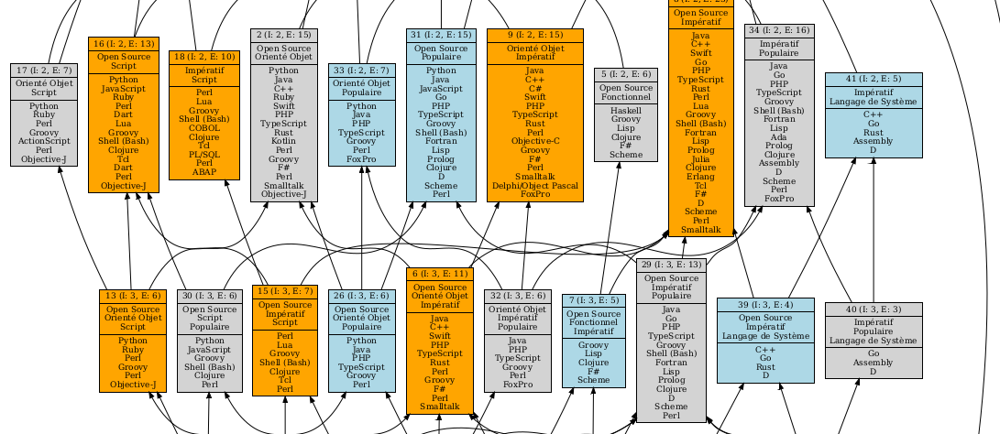

# HAI916I-TP2 - Analyse formelle de concepts, Triadic, analyse relationnelle
## Adam SAID - Arnaud COSSU


### Création du graphe de relation
1. Générer le graphe textuel .dot : 
```bash
java -jar fca4j-cli-0.4.4.jar LATTICE dataset/Languages.csv -i CSV -g Lattice/languages.dot -d FULL
```

2. Génération du pdf à partir du .dot : 
```bash 
dot -Tpdf Lattice/languages.dot -o Lattice/languages.pdf
```

3. Le graphe est disponible en PDF dans le dossier Lattice


### Relations sur le dataset
